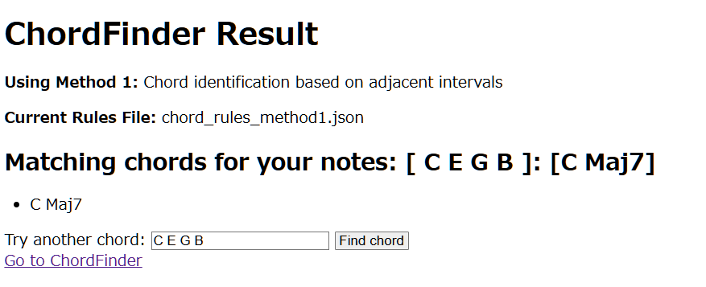

# ChordFinder
### By: Nick Kelley ([@nksz6](https://github.com/nksz6))

A Spring Boot web application that identifies musical chords from user-input notes using configurable chord rules.

## Features
- Input 3-7 musical notes (e.g. "C E G" for C Major)
- Identifies common chord types including:
  - Major and minor triads
  - 7th chords (major, minor, dominant)
  - Extended chords (9th, 11th, 13th)
  - Sus2 and Sus4 chords
  - Augmented and diminished chords
- Configurable chord rules via JSON
- Clean web interface with instant results

## Getting Started
1. Clone the repository.
2. Make sure you have Java 21 and Maven installed.
3. Run the application.
4. Open http://localhost:8080 in your browser.
5. Enjoy!

## Technologies Used
- Java 21
- Spring Boot 3.4
- Thymeleaf templating
- Maven build system

## Contributors
- Nick Kelley
- Carter Johnson
- Rayleigh Thai